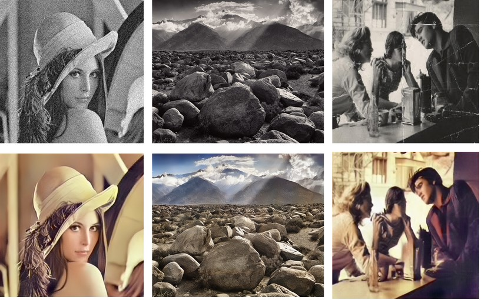
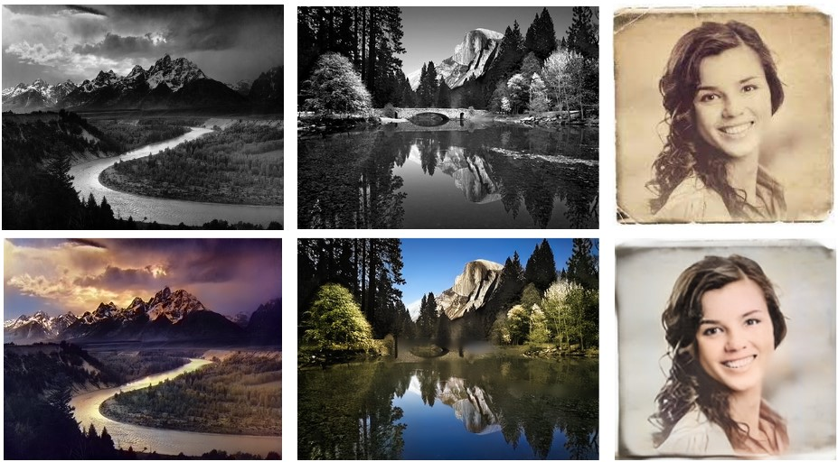
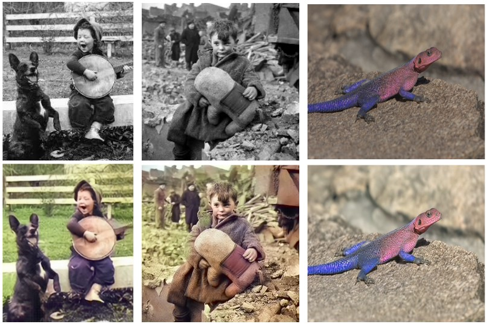

# Restoration-Colorization-Enhancement-of-Images
I have provided working code for the final pipeline.

I have uploaded the models to this [Link](https://drive.google.com/drive/folders/1Q6500KcgQls10Ljlte96HZYFEqSHszoH?usp=sharing)  
They have to be downloaded and inserted into the appropriate subdirectories (mentioned in the drive link) before the pipeline is run.  

## Pipeline  
The pipeline has 3 stages:  
1. Image Restoration
2. Image Colorization
3. Image Enhancement

The outputs of each stage is visually depicted in the image below.  

## Outputs
The project provides a pipeline that efficiently performs image restoration, colorization and enhancement in one go. Some of the outputs of the pipeline are shown below.  

